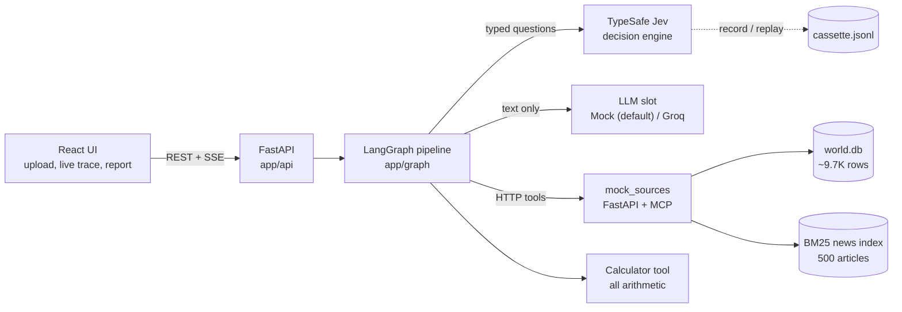
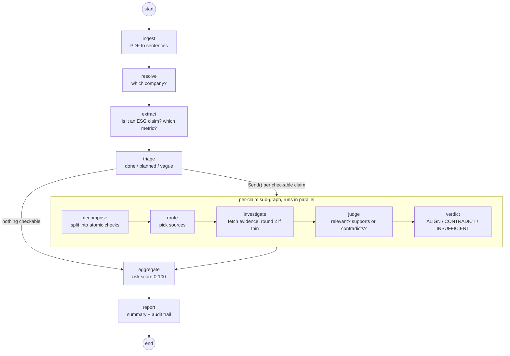

# Automated ESG Greenwashing Detection & Verification Agent

Reads a company sustainability report (PDF), pulls out every ESG claim, checks each one against external sources fetched at runtime and returns **ALIGN / CONTRADICT / INSUFFICIENT_EVIDENCE** (or NOT_CHECKABLE for vague talk and future targets), plus a **0-100 Greenwashing Risk Score** and a full audit trail.

EY problem statement. All companies and data are synthetic. It's a triage tool for a human reviewer, not a legal finding.

## Architecture



| Block | What it does |
|---|---|
| **LangGraph pipeline** | One node = one agent (`app/agents/`). Claims fan out in parallel into a per-claim sub-graph |
| **Jev** | Makes every decision as a typed question (yes/no probability, choice, score). No free-text parsing, no if/else rules |
| **LLM slot** | Only writes text (queries, explanations) from the facts it's given. Never decides |
| **mock_sources** | Stand-in for SEBI BRSR, CPCB OCEMS, NGT/SPCB orders, Global Forest Watch, REC registry, assurance statements, news |
| **Calculator** | % change, share, unit conversion, claimed-vs-filed gap. The expression is shown in the audit trail |

## LangGraph workflow



Every step emits an event that streams live to the UI and is saved as the audit trail.

## Problem statement coverage

| PS asks for | Where it is |
|---|---|
| Ingest sustainability reports / PDFs | `app/ingest/pdf.py`, layout-aware (columns, page breaks) |
| Extract key, falsifiable ESG claims with prompt engineering | `extractor.py` + `triage.py`, versioned prompts in `app/agents/prompts.py` |
| Agent breaks complex claims into searchable queries | `decomposer.py` splits into atomic sub-claims, `router.py` picks sources |
| Autonomously search external sources (mock DBs, news API, env datasets) | `investigator.py` calling `mock_sources/` over HTTP, 8 sources |
| Align / Contradict / Lack sufficient evidence | `judge.py`, 3-way verdict with probabilities |
| Hallucination control | relevance gate, grounding guard (abstains with no evidence), citation validator, arithmetic in a tool |
| Greenwashing Risk Score 0-100 (algorithmic) | `risk.py`, logistic model fitted on the benchmark |
| Transparent report: claim + evidence + reasoning | `reporter.py` + live audit trail in the UI |
| Modular, agent-based code | one agent per file, LangGraph orchestration, tools separated |
| Curated synthetic dataset of claims + news | `data_gen/`: 150 companies, ~9.7K rows, 500 news, 200-case benchmark, 4 report PDFs (23-28 pages) |
| Lightweight UI: upload, real-time extraction, reasoning, score | React (`web/`) instead of Streamlit, with a live agent trace |
| 2-3 page technical summary | `docs/TECHNICAL_SUMMARY.md` (agent design, prompts, limitations) |

## Results

| Test | Result |
|---|---|
| 4 demo PDFs, 46 planted claims | extracted 46/46, verdicts correct 46/46 |
| Company risk | greenwasher 56 > mixed 45 > honest 34 > unknown 24 |
| Benchmark (200 cases) / held-out (172 fresh) | 0.98 / 0.977 accuracy |
| Ablation | no retrieval 0.35, news-only RAG 0.45, full agent 1.00 (test split) |

Data is synthetic and self-generated, so these show the method works, not real-world accuracy. Details: `docs/TECHNICAL_SUMMARY.md`, `verification_pack/`.

## Run it (PowerShell)

```powershell
python -m venv venv; .\venv\Scripts\Activate.ps1
pip install -r requirements.txt
# .env  ->  TYPESAFE_API_KEY=your_key   (no key? set JEV_MODE=replay)
.\scripts\run_backend.ps1     # http://127.0.0.1:8000/docs
.\scripts\run_frontend.ps1    # http://localhost:5173
python -m pytest -q           # 85 tests, offline
```

## Folders

```
app/            agents/, graph/, decision/jev.py, tools/, ingest/, llm/, api/
mock_sources/   data source APIs + MCP server
data_gen/       synthetic world + benchmark generator
report_gen/     builds the demo PDFs
eval/           benchmark, report eval, risk fitting, robustness
data/           world.db, reports, benchmark, Jev cassettes
web/            React UI
docs/           technical summary, architecture, API contract
verification_pack/  proof, DB exports, honest evaluation
scrap/          old v1 code, not used
```
